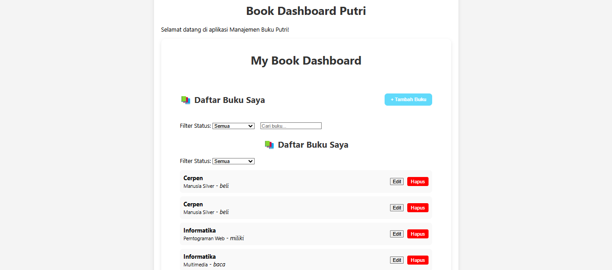
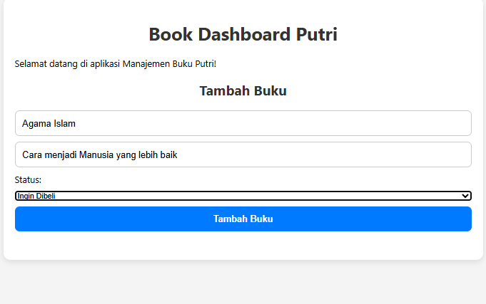
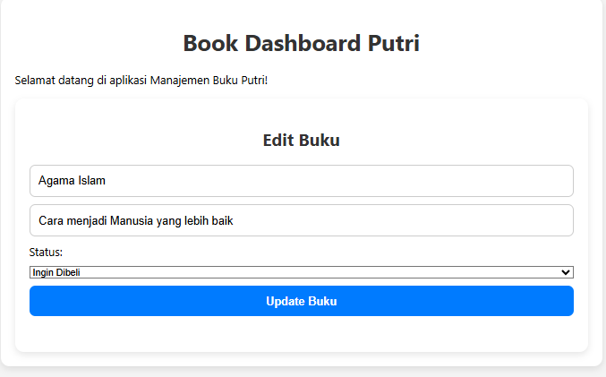
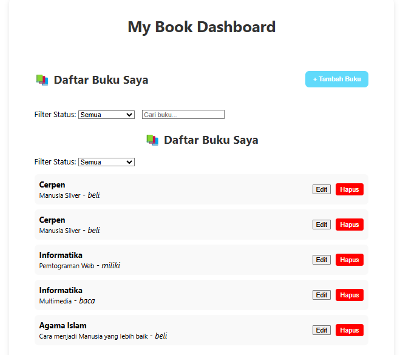
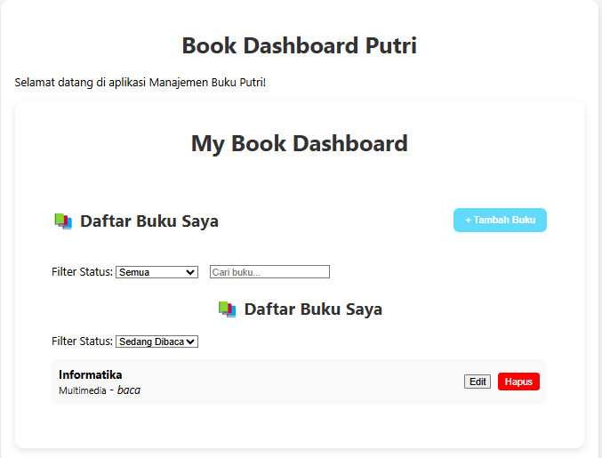

📚 My Book Dashboard

Fitur Utama Aplikasi

-  Tambah buku baru dengan informasi judul, penulis, dan status: miliki, baca, atau wishlist.
-  Edit informasi buku yang sudah ada dalam daftar.
-  Hapus buku dari daftar koleksi.
-  Cari buku berdasarkan judul atau penulis.
-  Filter buku berdasarkan status kepemilikan (Miliki, Baca, Wishlist).
-  Penyimpanan data menggunakan localStorage, sehingga data buku tetap ada meskipun aplikasi dimuat ulang.
-  State management menggunakan React Context API untuk mengelola status aplikasi secara global.

-Tampilan halaman utama

Teknologi yang Digunakan
React JS: Untuk membangun antarmuka pengguna.

React Router DOM: Untuk navigasi antar halaman.

React Context API: Untuk pengelolaan state global.

localStorage: Untuk menyimpan data buku secara permanen di browser.

CSS: Untuk styling dan tata letak aplikasi.